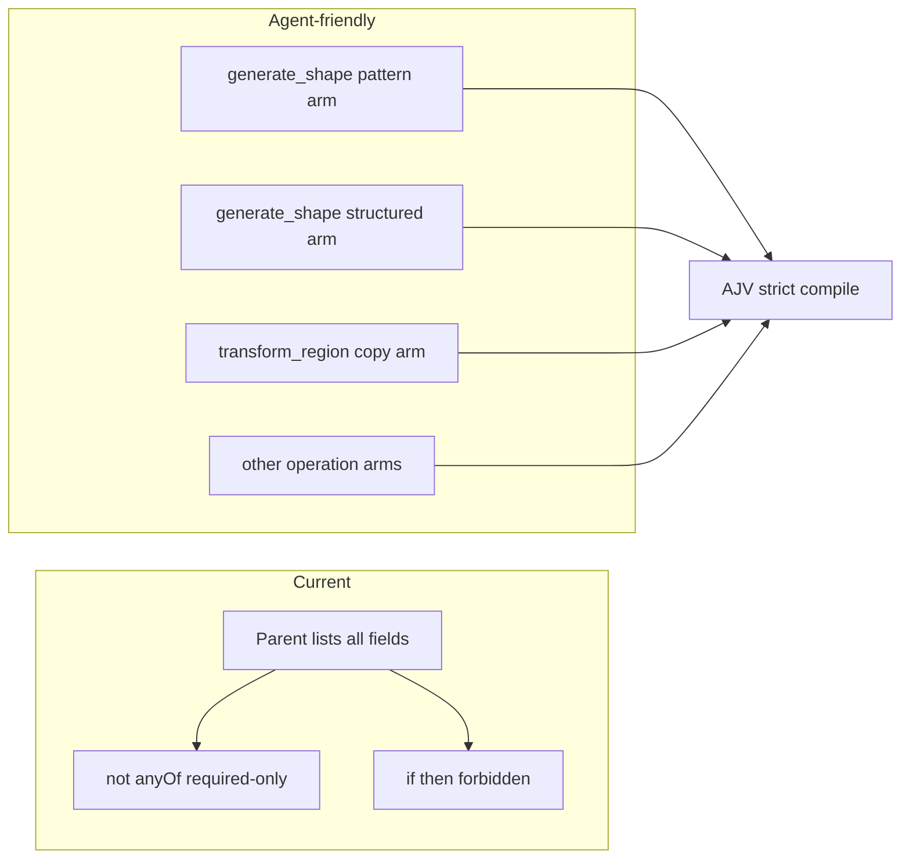

# Agent-friendly `oneOf` variants

The white screen is AJV `strictRequired` on nested `{ required: ["shape"] }` in [src/webmcp/tool-schemas.ts](src/webmcp/tool-schemas.ts). Do **not** fix it with empty `properties: { field: {} }` stubs. Those compile, but tool clients (and models) often flatten `oneOf` and then see typeless fields.

Do **not** set `strictRequired: false`. Keep `strict: true` in [src/webmcp/tool-handlers.ts](src/webmcp/tool-handlers.ts) and tests.

Do **not** split tools. Keep `generate_shape` and `transform_region`. Each tool becomes a discriminated `oneOf` of complete object schemas.

## Why this is better for agents

Models mostly read `properties` + `required` + `description`. They barely follow `not`, `anyOf` of required-only objects, or `if`/`then`.

So each variant must:
- Have a `title` and `description` (which call this is)
- List **only** the fields for that call, each with `type` and `description` (WebMCP skill)
- Use `additionalProperties: false`
- Put `required` next to real `properties` (AJV strict + readable)

Parent schemas must **not** dump every possible field into a kitchen-sink `properties` bag. That is how mixed `pattern` + `shape` calls get invented.

Reuse the existing const field schemas (`expectedRevision`, `pattern`, `bounds`, `blockId`, …). Duplicate the **references** across arms; do not copy new type rules.

## `generate_shape`

Replace the current `oneOf` + `requiredFields` with two complete arms. No root `properties` for `pattern`/`shape`/`region` together.

- **pattern**: `title: "pattern"`. `required: ["expectedRevision", "pattern"]`. `properties`: `expectedRevision`, `pattern` (keep minLength/maxLength/description), optional `dryRun`.
- **structured**: `title: "structured"`. `required: ["expectedRevision", "shape", "region", "block"]`. `properties`: those plus optional `state`, `objectId`, `dryRun`.

Keep the tool-level `description` that both modes exist. Mixed `{ pattern, shape, region, block }` fails because neither arm allows the extra keys.

Delete `requiredFields`.

## `transform_region`

Delete `operationRule`. Replace `allOf` + `if`/`then`/`not` with five `oneOf` arms, `operation` as a single-value enum (not a shared 5-value enum on the parent):

| title | required extra | properties besides expectedRevision, operation, region, dryRun |
|---|---|---|
| copy | offset | offset |
| move | offset | offset |
| rotate | rotation | rotation |
| mirror | axis | axis |
| replace_type | from, to | from, to |

Each arm: `additionalProperties: false`, `required` includes `expectedRevision`, `operation`, `region`, plus that op’s fields. `operation: { type: "string", enum: ["copy"], description: "..." }` (same for the other ops).

Unrelated fields (`copy` + `rotation`) fail the same way mixed generate_shape fails.

## Tests only in [src/webmcp/tool-schemas.test.ts](src/webmcp/tool-schemas.test.ts)

The XOR / per-operation cases already match this design. Update:

- `"requires expectedRevision on every write tool"` — today it reads `schema.required` on the root. After this, `expectedRevision` lives on each `oneOf` arm. Assert every arm’s `required` includes it instead of the root.
- Keep compile-all, extra-property reject, generate_shape XOR, transform per-op tests.

Do not change [src/webmcp/tool-handlers.ts](src/webmcp/tool-handlers.ts) runtime branching. Same JSON still reaches the engine.

## Boot safety

Do not compile AJV schemas at module import time. A WebMCP-only schema mistake
must not stop React from mounting for human users.

- Compile validators lazily when `createArenaToolHandlers()` is called.
- Cache the successfully compiled validator map.
- Feature detection in `registerArenaTools()` happens before handler creation,
  so unsupported browsers skip AJV compilation entirely.
- Create handlers inside the existing registration `try` block. A compile or
  registration failure returns `false`; the human editor remains available.
- Keep `strict: true`. Do not silence schema errors globally.

## Verify

- `npx vitest run src/webmcp/tool-schemas.test.ts src/webmcp/tool-handlers.test.ts` (and lint if the file is touched)
- Reload `http://localhost:5173/` — `#root` mounts, not a white empty page
