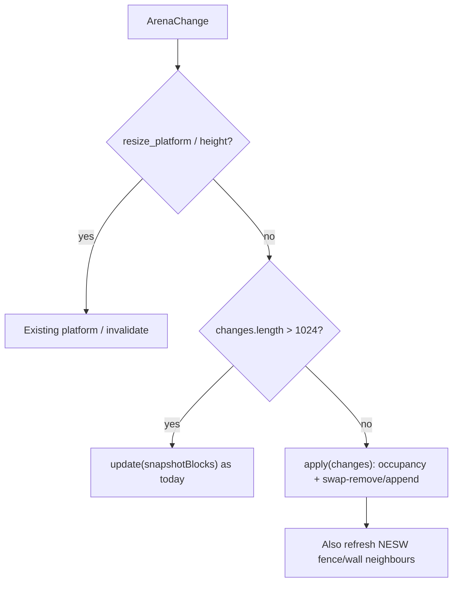

# Incremental instance updates from ArenaChange

## Problem

Every committed edit hits [`refreshBlocks`](src/render/three-renderer.ts) → `snapshotBlocks()` + [`BlockMeshRegistry.update`](src/render/block-mesh-registry.ts), which regroups **every** placed cell and rewrites every `InstancedMesh`. At max platform that is ~316k matrices per single place.

`ArenaChange.changes` already lists the exact cells (`before` / `after`). Use that.

## Approach (one path + one fallback)

- **Small/typical edits** (place, batch ≤256, modest shapes): patch those instances only.
- **Huge fills**: keep today’s `update(snapshot)` — no chunk mesher, no second meshing system.
- Occupancy in the registry is a **render cache** for variants (especially fence connections). Core remains source of truth.

## Registry: keep an index, patch slots

In [`src/render/block-mesh-registry.ts`](src/render/block-mesh-registry.ts):

1. Persist what `update()` already builds ephemerally:
   - `occupancy: Map<CoordinateKey, Block>`
   - `instanceAt: Map<CoordinateKey, { variantKey, index }>`
   - per-mesh **mutable** `Coordinate[]` (same order as instance IDs, so raycast `coordinateFor` stays correct)

2. `update(blocks)` stays the full rebuild (init + fallback). After grouping, write occupancy + `instanceAt` so later `apply()` is valid.

3. Add `apply(changes: readonly BlockChange[])`:
   - Write occupancy from each change (`after` set / `before`-only delete).
   - Refresh set = each `change.position` **plus** NESW neighbours that are currently `oak_fence` or `stone_wall` (connections are horizontal only; already how `variantFor` works).
   - For each refresh cell: if variant key unchanged, skip; else **swap-remove** the old slot and **append** the new one (`variantFor` + existing `isConnectable` over occupancy).
   - Grow capacity with the existing `nextCapacity` / recreate-mesh path when a mesh fills.
   - On add, expand that mesh’s bounding sphere to the new point. Do **not** `computeBoundingSphere()` over the whole mesh on every place (that would re-scan 100k stones). Removals may leave a slightly large sphere — fine for culling/raycast.

Swap-remove is the whole instance algorithm (last instance moves into the hole, `count--`, fix `instanceAt` for the moved cell). No per-edit copy of the world.

## Renderer: two-line policy

In [`src/render/three-renderer.ts`](src/render/three-renderer.ts) subscribe callback (today always `refreshBlocks()`):

- `resize_platform` / `resize_height`: unchanged
- else if `change.changes.length > 1024`: `refreshBlocks()` (named constant, e.g. `FULL_REBUILD_AFTER`)
- else: `this.blocks.apply(change.changes)` + `invalidate()`

Preview stays live; it just stops rebuilding unrelated instances.

## Tests (registry only)

Extend [`src/render/block-mesh-registry.test.ts`](src/render/block-mesh-registry.test.ts):

- `apply` add then remove updates `count` and `coordinateFor` without needing a full `update` of other cells
- Place stone east of a fence: fence leaves `oak_fence|0000` and appears on `oak_fence|0100`
- After `apply`, `update(snapshot)` still converges (fallback path)

No engine/contract changes. No new files.

## Verify

- `npx vitest run src/render/block-mesh-registry.test.ts`
- lint / typecheck on the two touched source files
