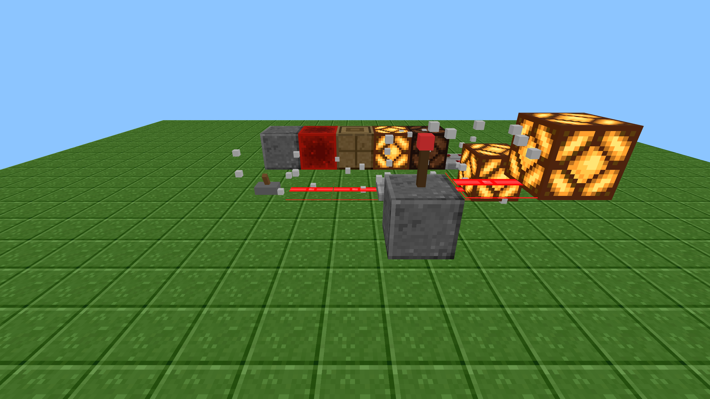
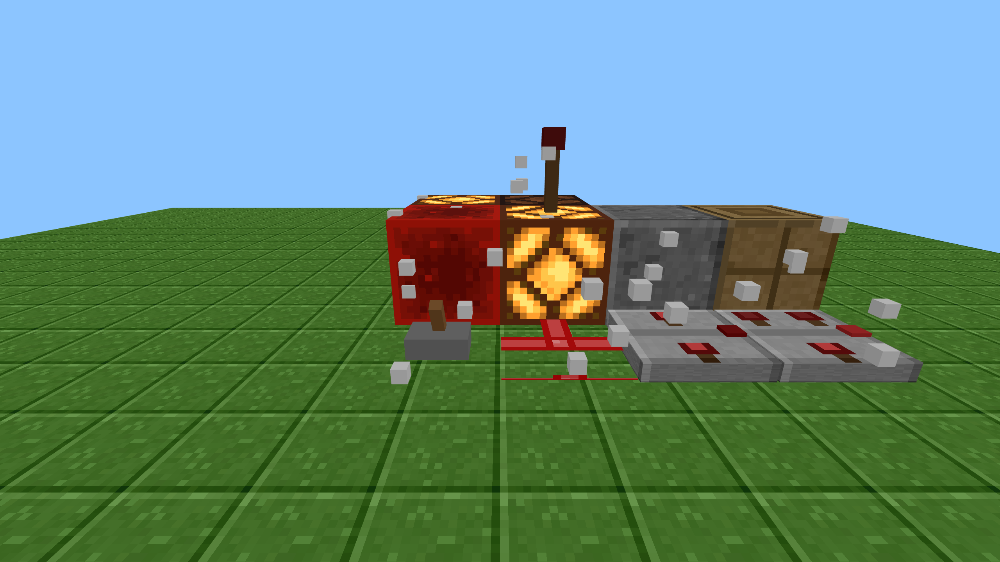
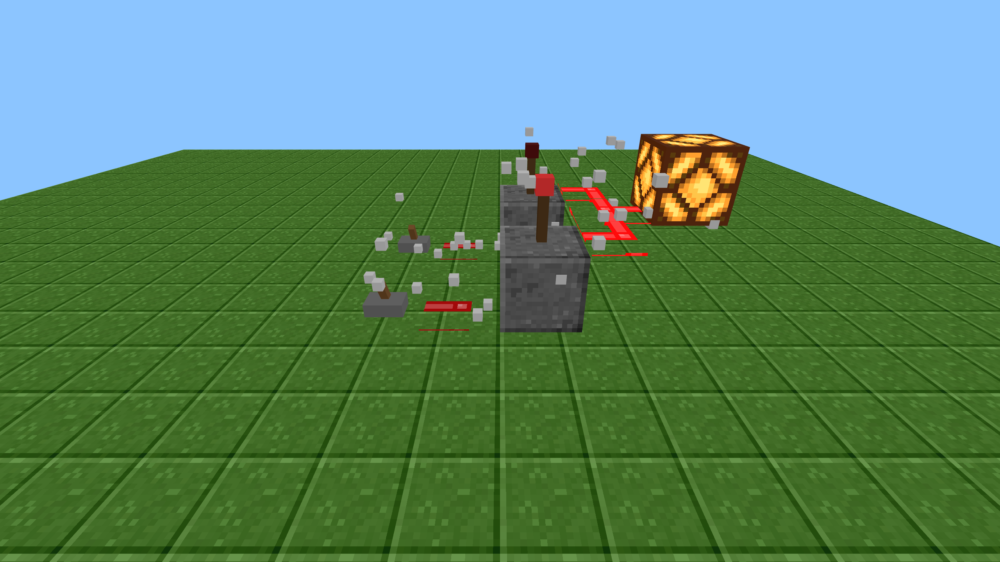

# Redstone World
     |
     +-- landscape (walk, place cubes)     
     |
     +-- redstone computer parts           --> LimeStone rules + redstone-world list
     |
     +-- pictures / sounds                

A web-based (Three.js) recreation of Minecraft's **redstone sandbox**: first-person exploration, pixel block textures, realistic redstone signal simulation, and the classic chat box repurposed as an **AI dialogue** window — describe circuits in natural language and the AI, constrained by a sandbox, **can only place redstone blocks**.

**▶ Play online: https://maoxin1234.github.io/redstone-world/**



| Redstone blocks | NAND circuit |
|:---:|:---:|
|  |  |

---

## Quick Start

You need **Python** (recommended) or **Node.js** installed locally.

- **Windows**: double-click [`start.bat`](start.bat)
- **PowerShell**: `./start.ps1`
- **macOS / Linux**: `./start.sh`

The script starts a local server ([`server.py`](server.py), with no-cache headers) and opens your browser to `http://localhost:8000`.
Close the terminal window to stop the server.

> Do not open `index.html` directly: the project uses ES Modules + local textures and must be served over HTTP.

---

## Controls

| Action | Input |
|------|------|
| Enter world / lock mouse | Click the screen |
| Move | `W` `A` `S` `D` |
| Ascend / descend | `Space` / `Left Shift` |
| Look around | Move mouse |
| Break block | Left click |
| Place block | Right click |
| Interact with lever/button | Right click |
| Rotate repeater/comparator facing | Right click |
| Toggle comparator compare/subtract mode | `Shift` + right click |
| Select block | Number keys `1`–`9` or scroll wheel |
| Open AI chat | `T` or `/` |
| Release mouse / close chat | `Esc` |

---

## Block List (10 types)

| id | Name | Role |
|----|------|------|
| `stone` | Stone | Solid block, can be powered and conduct signal |
| `redstone_wire` | Redstone Dust | Ground wire, strength 0–15, decays 1 per block |
| `redstone_torch` | Redstone Torch | Signal source, normally 15; **turns off when block below is powered** (NOT gate core) |
| `redstone_block` | Redstone Block | Constant signal source, always 15 |
| `lever` | Lever | Manual switch (right click to toggle) |
| `button` | Button | Pulse output, auto-off after ~1 second |
| `repeater` | Repeater | **Has facing**; rear input → front boosted to 15 (boost/diode) |
| `comparator` | Comparator | **Has facing**; compare: pass if rear ≥ sides else 0; subtract: rear − side |
| `lamp` | Redstone Lamp | Lights when signal ≥ 1 |
| `piston` | Piston | Solid decorative block (push not yet implemented) |

See [`RULES.md`](RULES.md) for redstone mechanics (also used as the AI rulebook).

---

## AI Chat and Agent

Press `T` to open chat and tell the AI what to build, for example:

- "Build a switch-controlled lamp"
- "Build a NOT gate / NAND gate"
- "Use a repeater to boost signal"
- "Build a subtract circuit with a comparator"

**Two modes:**
- **Local mode (default)**: built-in rule engine, works offline, recognizes common circuit keywords.
- **Claude API**: click ⚙️ top-right, enter Anthropic API Key (default model `claude-opus-4-8`) for arbitrary natural language, `facing`/`mode` support, and **self-correction** on errors. Key stays in browser memory only; refresh clears it.

**Agent sandbox** ([`agent.js`](js/agent.js)) is the world's only write path, ensuring AI "can only build redstone":
- Block ids must be on the whitelist or are rejected;
- Coordinates limited to ±32, max 200 actions per plan;
- AI may only output `place` / `remove` — nothing else;
- Validation errors are sent back to the AI for correction.

---

## Project Structure

```
.
├── index.html            # Entry page
├── style.css             # UI styles (crosshair/hotbar/chat)
├── server.py             # Local dev server (no cache)
├── start.bat/.ps1/.sh    # One-click launch scripts
├── RULES.md              # Redstone rulebook (also AI system knowledge)
├── js/
│   ├── main.js           # Entry: UI, input, wires modules together
│   ├── world.js          # First-person 3D world: terrain/render/interaction/redstone
│   ├── blocks.js         # Block definitions + redstone simulation (facing, fixed-point)
│   ├── textures.js       # Load/generate block materials and hotbar icons
│   ├── agent.js          # Agent sandbox: validate and execute AI JSON plans
│   └── ai.js             # Chat AI: Claude API + local fallback + system prompt
├── assets/               # Block texture PNGs (procedural + extracted from renders)
├── source_renders/       # Original Minecraft Wiki isometric renders (texture source)
├── tools/
│   ├── generate_textures.py  # Procedurally generate pixel texture PNGs
│   └── extract_faces.py      # Extract flat faces from isometric renders
└── vendor/               # Three.js + PointerLockControls (local copy, offline-ready)
```

---

## Redstone Simulation

`simulate()` ([blocks.js](js/blocks.js)) uses **fixed-point iteration** because torch, repeater, and comparator outputs depend on each other:

1. Signal sources (torch/block/lever/button) inject 15 into adjacent components.
2. Redstone dust/solid blocks propagate via BFS, −1 per block, stops at 0.
3. Redstone torch: turns off when support block below is powered (natural inverter).
4. Repeater/comparator use `facing`: **rear** is input, **front** is output — directional endpoints, not penetrated from the wrong side.
5. Iterate until all component states stabilize.

---

## Custom Textures

To swap in your own resource pack:

- **Full blocks** (stone, redstone block, lamp, piston, etc.): overwrite the matching **flat 16×16 PNG** in `assets/` (see directory for filenames), then refresh.
- Only have Minecraft Wiki **isometric renders**? Put them in `source_renders/` and run `python tools/extract_faces.py` to extract flat faces.
- Regenerate built-in procedural textures: `python tools/generate_textures.py` (⚠️ overwrites matching files in `assets/`).

---

## Tech Stack

- **Three.js** r160 (3D rendering, local copy in `vendor/`)
- **PointerLockControls** (first-person camera)
- Native ES Modules, no bundler required
- **Pillow** (offline texture generation only)
- Optional **Anthropic Claude API** (natural language building)

## License

Code is open source under the [MIT License](LICENSE).
Block renders in `source_renders/` are from Minecraft Wiki; copyright belongs to Mojang/Microsoft and contributors, for educational use only — not covered by the MIT license. This project is a non-commercial technical recreation demo.
